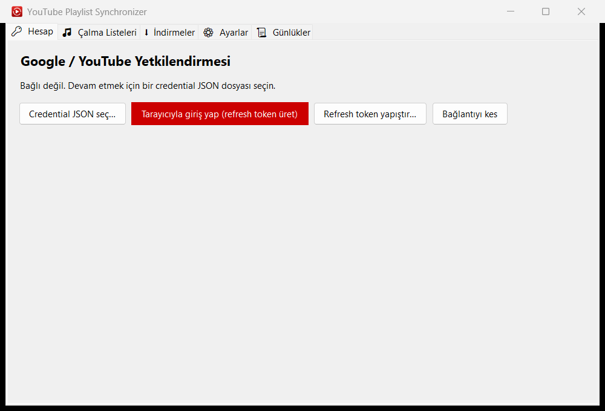
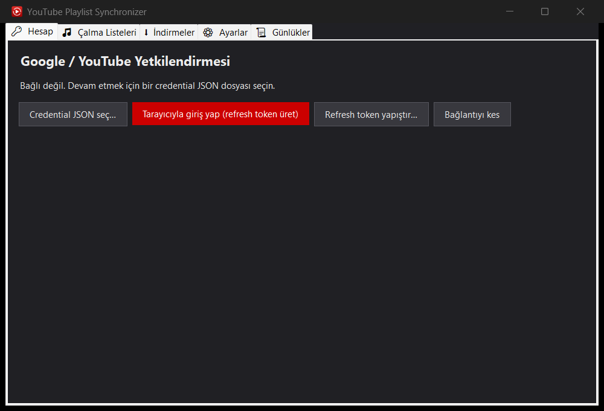

<div align="center">

# YouTube Playlist Synchronizer

**Keep local folders in lockstep with your YouTube playlists — as music or video — from a clean WinForms app or a silent background run.**

[](https://dotnet.microsoft.com/)
[](#)
[](LICENSE)
[](#download)




</div>

---

## What it does

Pick the playlists from your own YouTube account, point each one at a folder, and the app downloads
**only the videos you don't already have** — straight into that folder. Run it once to set things up,
then let it sync silently in the background every time your PC starts.

- 🔐 **Your account, your playlists.** Sign in with Google once (OAuth, browser-based) and the app lists
  every playlist you own — public, unlisted and private.
- 🎵 **Music or video, your call per playlist.** Best quality, a detailed custom picker (format + bitrate),
  or the smallest-on-disk tier with an optional [Codec2](https://en.wikipedia.org/wiki/Codec_2) re-encode.
  Video downloads pick a YouTube-style resolution and match the audio to it.
- 🧠 **Never re-downloads.** It scans the target folder by the `(videoId)` in each filename — and ignores
  image files, so a thumbnail that landed early can never be mistaken for the video and skip it.
- 🪟 **Tabbed, resolution-independent UI.** Account, Playlists, Downloads, Settings and Logs each on their
  own page, laid out with no absolute coordinates so it scales to any window size or DPI.
- 🤖 **Headless background mode.** `--sync` runs with no window (just a tray icon you can double-click to
  open the GUI), syncs your saved playlists, then exits — perfect for a startup entry.
- 📦 **One file.** A single framework-dependent `.exe`; no installer, no loose DLLs. It even fetches
  `yt-dlp` itself if it isn't already on your PATH.

## How it works

```
Google OAuth (PKCE loopback)  ──►  refresh token (DPAPI-encrypted, under UserData)
        │
        ▼
YouTube Data API v3  ──►  your playlists  ──►  each playlist's video ids
        │
        ▼
SyncEngine  ──►  scan target folder (skip image files)  ──►  download the missing ids
        │                                                         │
        ▼                                                         ▼
   yt-dlp + ffmpeg  ──►  download into Cache  ──►  move finished media into the target folder
```

The naming convention matches the well-known `Title (VIDEOID).ext` scheme, so an existing library of
yt-dlp downloads is recognized as-is.

## Download

Grab the latest `YoutubePlaylistSynchroniszer.exe` from the
[**Releases**](https://github.com/muhammetozeski/YoutubePlaylistSynchroniszer/releases) page. It needs the
[.NET 10 Desktop Runtime](https://dotnet.microsoft.com/download/dotnet/10.0); everything else (yt-dlp) is
fetched on demand.

## Usage

### First run (GUI)

1. **Account** tab → *Pick credential JSON…* and choose your Google OAuth *client secret* `.json`
   (created in [Google Cloud Console](https://console.cloud.google.com/) with the *YouTube Data API v3*
   enabled). Then *Sign in with browser* to mint and store a refresh token — or paste an existing one.
2. **Playlists** tab → *Fetch playlists*, tick the ones you want, hit *Configure…* on each to set its
   target folder and quality.
3. *Sync selected* → watch live progress on the **Downloads** tab.

### Background sync (for startup)

```bat
YoutubePlaylistSynchroniszer.exe --sync
```

Runs with no window, syncs every playlist you ticked, shows a tray icon while it works (double-click to
open the GUI), then exits. Add that command to your startup folder / Task Scheduler and your folders stay
current automatically.

```
  --sync         Sync saved playlists with no window, then exit
  --gui          Open the graphical interface
  -h, --help     Help
  -v, --version  Version
```

## Build from source

```bash
git clone https://github.com/muhammetozeski/YoutubePlaylistSynchroniszer.git
cd YoutubePlaylistSynchroniszer
dotnet build                # debug
dotnet publish -c Release    # single-file exe in bin/Release/.../publish
```

Requires the .NET 10 SDK.

## Engineering notes

A few things this project does deliberately well:

- **Resilience as a single seam.** Every meaningful operation flows through one helper that logs its
  start/end/inputs/result and **measured duration**, retries transient failures with Polly (exponential
  backoff + jitter), and bounds long awaits with both a `CancellationToken` and a `WaitAsync` guard. Only
  the outermost guard ever swallows an error — and it offers the user a retry (or a restart-and-retry for
  fatal failures).
- **Exhaustive logging.** Logging is on by default; the on-disk log shows the full lifecycle of every
  operation, which makes background runs auditable after the fact.
- **Localization by reflection.** UI strings live as fields on one class; the Turkish defaults are the
  built-in baseline and English ships as an editable `lang.en.xml`. Adding a language is dropping in a file.
- **Secrets stay local.** The client secret and refresh token are encrypted with Windows DPAPI under
  `UserData` next to the exe and are never committed or transmitted anywhere but Google.
- **Portable by design.** `UserData` (settings, credentials, logs, profiles) and `Cache` (transient
  downloads, auto-cleaned) both live next to the exe.

## Privacy

Your Google credentials and refresh token never leave your machine except to talk to Google's own OAuth and
YouTube endpoints. They are stored DPAPI-encrypted (bound to your Windows user) under `UserData`. Nothing is
sent to any third party, and the repository ignores all credential material.

## License

[MIT](LICENSE) © Muhammet Özeski
